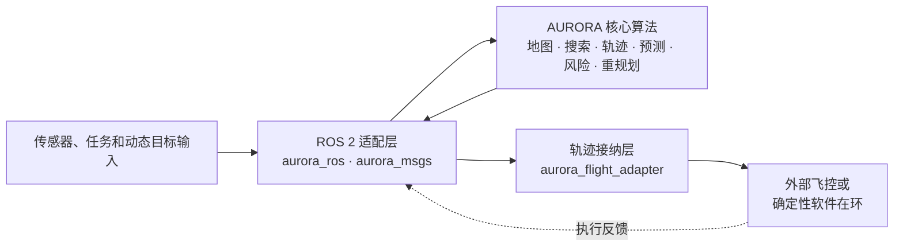
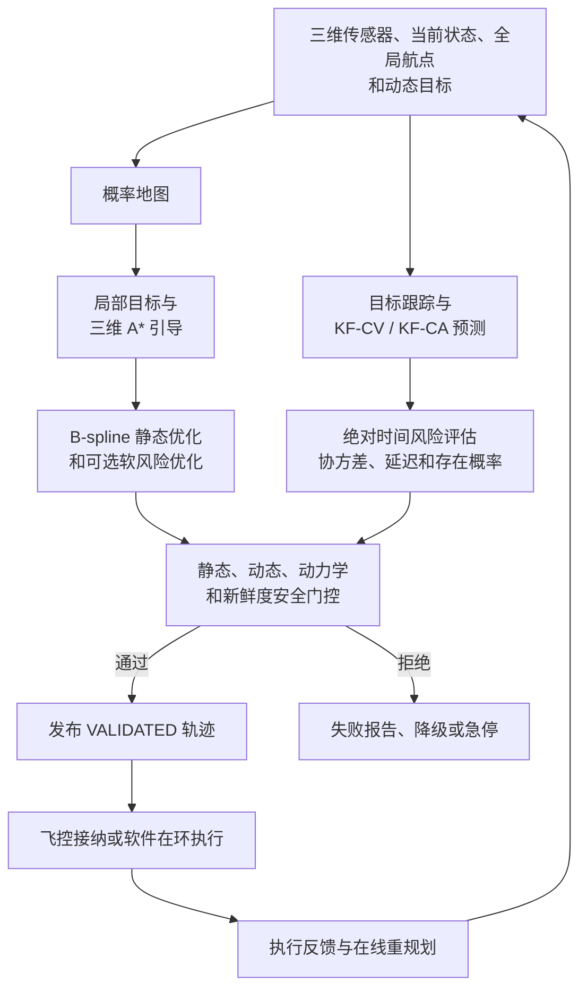

# AURORA-Planner

**Adaptive Uncertainty-aware Risk and Online Replanning for Aerial Robots**

*An ROS 2 local planner derived from EGO-Planner*

AURORA-Planner 是一个面向三维无人机局部飞行规划的 ROS 2 项目。它以[EGO-Planner](https://github.com/ZJU-FAST-Lab/ego-planner) 的三维局部规划思想为算法基座，重新实现了可脱离 ROS 1 运行的 C++ 规划核心，并在此基础上增加动态障碍物预测、不确定性风险评估和发布前安全接纳。

项目负责局部轨迹生成、避障、风险检查和在线重规划；全局路径、姿态控制、飞控和具体传感器驱动通过 ROS 2 接口接入。

## 核心改进

| 能力 | EGO-Planner 基线 | AURORA-Planner 扩展 |
|---|---|---|
| 规划空间 | 三维局部飞行规划 | 保留三维规划、连续导数和 B-spline 轨迹语义 |
| 地图 | 局部占据栅格和射线更新 | 概率体素、log-odds 更新、障碍膨胀、未知空间和观测新鲜度 |
| 障碍物 | 主要面向静态障碍物 | 外部动态目标跟踪，或输入未关联检测后内部关联 |
| 动态处理 | 不提供时空预测风险闭环 | KF-CV/KF-CA 预测、协方差传播、目标形状和存在概率 |
| 风险模型 | 几何碰撞与动力学代价 | 延迟、定位/执行误差、地图质量和预测不确定性的统一风险上下文 |
| 安全输出 | 规划后发布轨迹 | 3-sigma 动态硬门控、软风险优化、过期信息失败关闭和急停锁存 |
| 软件结构 | ROS 1/catkin 工程 | ROS 2/ament 适配层 + 无 ROS 依赖的核心库 + 飞控接纳边界 |

软风险项只影响优化目标，不能替代发布前硬安全检查。软风险计算异常、超出预算或
不可用时会回退到静态优化，并重新执行安全门控。

## 架构与处理流程

### 项目架构



### 处理流程



轨迹使用带绝对时间的三次均匀 B-spline 段，支持位置、速度、加速度和 jerk 等物理
导数检查。严格七阶 minimum-snap 轨迹和五次航点参考轨迹用于参考生成与数学验证；
局部规划默认保持 EGO 风格的 B-spline 优化路径。

## 运行环境

| 模块 | 所需运行环境 |
|---|---|
| 规划核心库 | C++17、CMake、Eigen3、ROS 2 `ament_cmake` 工作区 |
| ROS 2 规划节点 | Ubuntu 24.04 + ROS 2 Jazzy |
| 点云输入 | ROS 2 `sensor_msgs`、TF2 和 `sensor_msgs/msg/PointCloud2` |
| 深度图输入 | ROS 2 `sensor_msgs/msg/Image`、`CameraInfo` 和 TF2；支持 `16UC1`/`32FC1` |
| 动态目标输入 | ROS 2 Jazzy、AURORA 自定义消息；支持外部 track 或内部未关联检测模式 |
| 软件在环执行 | `aurora_sim` 确定性三维执行模型，与 ROS 2 Jazzy 工作区配套 |
| 回放与测试 | ROS 2 `launch_testing`、`rosbag2_py`、SQLite3 rosbag2 |
| 当前不支持 | ROS 1/catkin 运行时、Ubuntu 22.04 + ROS 2 Humble 正式支持、具体 PX4/Gazebo/GZ 飞控后端和真实无人机飞行 |

## 后续计划

以下功能将在后续版本中完善：

- 在 Ubuntu 22.04 + ROS 2 Humble 上完成真实构建、测试和发布 smoke test；
- 完成 PX4/Gazebo/GZ、MAVROS 2 或 `px4_msgs`/`px4_ros_com` 的具体后端接入；
- 在真实传感器和目标飞控上验证 TF、QoS、时钟、拒绝回执和连续三维重规划；
- 在目标计算机上测量规划周期、P95/P99、内存和动态分配；
- 生成包含实际安装版本的最终 SBOM，并完成正式版本发布审计。

## 安装与构建

以下命令对应已验证的 Ubuntu 24.04 + ROS 2 Jazzy 环境。Ubuntu 22.04 应将
`jazzy` 替换为 `humble`，但 Humble 兼容性仍需单独验证。

```bash
source /opt/ros/jazzy/setup.bash

sudo apt update
sudo apt install python3-colcon-common-extensions python3-rosdep libeigen3-dev

# 首次使用 rosdep 时，按系统提示完成 rosdep init；之后执行：
rosdep update
rosdep install --from-paths src --ignore-src --rosdistro jazzy -r -y

colcon build --base-paths src --symlink-install \
  --cmake-args -DCMAKE_BUILD_TYPE=RelWithDebInfo \
               -DPython3_EXECUTABLE=/usr/bin/python3
source install/setup.bash
```

如果 shell 中的 Conda Python 排在系统 Python 前面，请确保构建时仍使用
`/usr/bin/python3`，否则可能找不到 ROS 2 的 `catkin_pkg` 或 ament Python 模块。

## 启动

只启动规划节点：

```bash
source /opt/ros/jazzy/setup.bash
source install/setup.bash
ros2 launch aurora_bringup aurora_planner.launch.py
```

启动规划节点和确定性三维软件在环执行器：

```bash
ros2 launch aurora_bringup aurora_software_in_loop.launch.py
```

启动文件不会自动生成点云、动态目标或规划请求。规划器需要接收有效输入后才会
输出轨迹；默认配置还要求动态目标信息保持新鲜，即使当前没有动态目标也应发送
带正确时间戳的空 `DynamicObstacleTrackArray` 心跳。只做静态场景测试时，必须在
确认环境安全的前提下将 `risk.require_dynamic_information` 设为 `false`。

单独启动软件在环执行器：

```bash
ros2 launch aurora_sim aurora_sim.launch.py
```

## ROS 2 接口

默认节点为 `aurora_ros/aurora_planner_node`，默认坐标系为 `map`。所有三维状态、
航点、动态目标和轨迹的坐标语义必须一致；点云和深度图由适配层通过 TF 转换到
`map`。

### 输入

| 接口 | 类型 | 默认值或说明 |
|---|---|---|
| `/aurora/planning_request` | `aurora_msgs/msg/PlanningRequest` | 当前三维位置/速度/加速度和全局参考航点 |
| `/points` | `sensor_msgs/msg/PointCloud2` | `SensorDataQoS`，默认地图输入 |
| `/camera/depth/image_rect_raw` | `sensor_msgs/msg/Image` | `depth.enabled=true` 时启用 |
| `/camera/depth/camera_info` | `sensor_msgs/msg/CameraInfo` | 深度图启用时的针孔标定 |
| `/aurora/dynamic_obstacle_tracks` | `aurora_msgs/msg/DynamicObstacleTrackArray` | 默认动态输入；包含已关联目标或空心跳 |
| `/aurora/dynamic_obstacle_detections` | `aurora_msgs/msg/UnassociatedObstacleDetectionArray` | `dynamic_input_mode=internal_detections` 时使用 |

深度适配器当前支持单通道 `16UC1`（毫米）和 `32FC1`（米）。无效编码、标定、TF
或全无效图像不会刷新地图新鲜度。

### 输出

| 接口 | 类型 | 语义 |
|---|---|---|
| `/aurora/trajectory` | `aurora_msgs/msg/Trajectory` | 只发布通过静态和动态门控的 `VALIDATED` 轨迹 |
| `/aurora/planning_result` | `aurora_msgs/msg/PlanningResult` | 成功、失败、风险报告和安全报告 |
| `/aurora/planner_status` | `aurora_msgs/msg/PlannerStatus` | FSM 状态、重规划触发原因和连续失败计数 |
| `/aurora/emergency_stop_state` | `aurora_msgs/msg/EmergencyStopState` | 锁存急停状态；软件在环也订阅此状态 |

急停服务：

```bash
ros2 service call /aurora/set_emergency_stop aurora_msgs/srv/SetEmergencyStop \
  "{engage: true, reason: 'operator request'}"
```

`engage: false` 只请求显式复位，不会自动恢复旧任务。复位后需要新的规划请求，
且必须重新获得有效地图和动态信息。

完整字段、QoS 和时间语义见 [ROS 2 架构与接口](docs/architecture.md)；消息定义位于
[`src/aurora_msgs`](src/aurora_msgs)。

## 关键参数

默认配置位于 [`src/aurora_bringup/config/aurora_planner.yaml`](src/aurora_bringup/config/aurora_planner.yaml)。部署前请检查：

| 参数 | 默认值 | 作用 |
|---|---:|---|
| `map.frame` | `map` | 地图和风险评估坐标系 |
| `map.reject_unknown` | `true` | 是否拒绝未观测空间 |
| `vehicle.radius` | `0.65` | 飞行器保守包络半径，单位 m |
| `vehicle.max_velocity` | `3.0` | 最大速度，单位 m/s |
| `vehicle.max_acceleration` | `6.0` | 最大加速度，单位 m/s^2 |
| `planning.optimizer_lambda_risk` | `0.0` | 动态软风险优化权重；0 表示保持静态基线 |
| `risk.require_dynamic_information` | `true` | 是否要求新鲜动态信息心跳 |
| `risk.max_prediction_age` | `0.5` | 动态预测最大年龄，单位 s |
| `risk.sigma_multiplier` | `3.0` | 动态不确定性保守包络倍数 |
| `dynamic_input_mode` | `external_tracks` | `external_tracks` 或 `internal_detections` |

风险延迟参数将感知、跟踪、规划、执行延迟和安全余量转换为动态预测提前量，
不会静默修改轨迹的绝对执行时间。风险报告中的 3-sigma 检查是保守几何安全上界。

全部参数和单位见 [参数参考](docs/parameters.md)。

## 软件包

| 包 | 作用 |
|---|---|
| `aurora_math` | B-spline、导数、minimum-snap、时间分配和弧长重采样 |
| `aurora_map` | 三维概率体素、射线更新、查询和障碍膨胀 |
| `aurora_search` | 三维 26 邻域 A* 绕行搜索 |
| `aurora_trajectory` | B-spline 初值、静态优化和轨迹验证 |
| `aurora_prediction` | KF-CV/KF-CA 动态目标预测和协方差传播 |
| `aurora_tracking` | 未关联三维检测的确定性关联和 track 生命周期 |
| `aurora_risk` | 动态时空风险、地图质量和统一不确定性评估 |
| `aurora_planner_core` | 局部目标、规划编排、重规划和安全门控 |
| `aurora_msgs` | 轨迹、预测、风险、状态和急停消息/服务 |
| `aurora_ros` | PointCloud2、深度图、TF、参数和 ROS 2 节点适配 |
| `aurora_flight_adapter` | 验证轨迹的飞控无关接纳、采样和反馈映射 |
| `aurora_sim` | 确定性三维软件在环执行器 |
| `aurora_bringup` | 默认参数和启动文件 |

`aurora_math`、`aurora_map`、`aurora_search`、`aurora_trajectory`、
`aurora_prediction`、`aurora_tracking`、`aurora_risk` 和
`aurora_planner_core` 是可脱离 ROS 节点测试的核心库。核心库不依赖 `rclcpp`、
`sensor_msgs` 或 TF 类型。

## 测试与验证

构建后运行完整测试：

```bash
source /opt/ros/jazzy/setup.bash
source install/setup.bash
colcon test --base-paths src --executor sequential \
  --event-handlers console_direct+
colcon test-result --test-result-base build --all --verbose
```

测试覆盖三维地图、A*、B-spline 和 minimum-snap、动态预测、风险门控、跟踪、
PointCloud2/深度图适配、ROS 2 topic/service、rosbag2 回放、过期信息、输入故障、
轨迹接纳和软件在环执行。

核心规划性能基准：

```bash
colcon build --base-paths src --packages-select aurora_planner_core \
  --cmake-args -DCMAKE_BUILD_TYPE=RelWithDebInfo -DAURORA_BUILD_BENCHMARKS=ON
install/aurora_planner_core/lib/aurora_planner_core/aurora_static_planner_benchmark \
  --warmup 10 --iterations 100 --output /tmp/aurora-static.json
install/aurora_planner_core/lib/aurora_planner_core/aurora_static_planner_benchmark \
  --soft-risk --warmup 10 --iterations 100 --output /tmp/aurora-soft-risk.json
```

基准只测纯 C++ 规划调用，不包含 DDS、TF、传感器转换和飞控通信；性能数值必须在
目标计算机和部署参数下重新测量。更多基准说明见 [性能基准](docs/benchmarks.md)。

## 限制与后端接入

- AURORA 是局部规划器，不负责全局路径搜索、姿态控制或飞控模式管理。
- 当前没有内置 RViz 可视化节点；可用 ROS 2 标准工具或外部可视化工具查看消息。
- 动态预测是可解释的 KF-CV/KF-CA 基线，不是学习型意图预测器；预测质量取决于
  输入状态、协方差、时间戳和数据关联质量。
- 默认硬门控会拒绝占据、越界、未知或信息过期的危险情况；不要为了“让轨迹输出”
  而关闭这些检查。
- `aurora_flight_adapter` 不发送具体飞控命令。PX4/MAVROS 2/Gazebo/GZ 等后端
  需要在外部适配器中完成消息映射、时钟、拒绝回执和真实执行验证。

后端接入边界和验收顺序见 [外部飞控接入](docs/external-backends.md)，软件在环说明见
[仿真与执行闭环](docs/simulation.md)。

## 许可证与参考

AURORA-Planner 采用 **GPL-3.0-only**。

EGO-Planner 原项目地址：[ZJU-FAST-Lab/ego-planner](https://github.com/ZJU-FAST-Lab/ego-planner)。

## 开发资料

- [依赖与发行版](docs/dependencies.md)
- [ROS 2 架构与接口](docs/architecture.md)
- [参数参考](docs/parameters.md)
- [仿真与执行闭环](docs/simulation.md)
- [外部飞控接入](docs/external-backends.md)
- [API/兼容策略](docs/api-compatibility.md)
- [变更日志](CHANGELOG.md)
